# phpwasm-laravel-with-mysql

-777BB4)


ブラウザのタブの中だけで **本物の Laravel 13 + PHP 8.3** を起動しつつ、
**ブラウザの外で動いている本物の MySQL 8** へ **PDO + Eloquent** で接続するデモです。

隣の [NOGUD626/php-wasm-laravel-demo](https://github.com/NOGUD626/php-wasm-laravel-demo) が
「SQLite を VFS 上に持ったブラウザ完結版」だったのに対し、本リポは
**`@php-wasm/web` をカスタムビルドして `pdo_mysql` + WebSocket Networking を有効化** し、
**WS↔TCP プロキシ越しに OS プロセスとして動いている MySQL を読み書き** します。

> 元記事:[WASM な PHP でブラウザ内に Laravel 13 を立てる(php-wasm)](https://zenn.dev/nogu_d626/articles/c3e1ced70ae7b3)
> 元記事に「外部 DB(MySQL / PostgreSQL)接続 — ネットワークソケットが無い」と書いた制約を、本リポで埋めます。

## TL;DR

- **ブラウザのタブの中**で Laravel 13.14 / PHP 8.3.31 が起動する(`SAPI = wasm`)
- そこから `new PDO('mysql:host=127.0.0.1;dbname=demodb', ...)` で **TCP の MySQL** に繋がる
- Eloquent / migration / artisan / tinker / HTMX + Alpine.js のフォーム CRUD まで動く
- それを実現する4つの仕掛けが入っている: **(1) カスタム wasm ビルド** **(2) WebSocket↔TCP プロキシ** **(3) WebSocket EventEmitter シム** **(4) Service Worker による iframe スコープ横取り**

## 構成図

```mermaid
flowchart LR
    subgraph BROWSER[ブラウザ タブ]
        direction TB
        Host["ホスト UI<br/>(Vite + TypeScript)"]
        SW["Service Worker<br/>/laravel/* 横取り"]
        IF["iframe<br/>Laravel ミニサイト"]
        WASM["@php-wasm/web (custom)<br/>PHP 8.3 + pdo_mysql<br/>+ -lwebsocket.js"]
        BC["BroadcastChannel"]
        Host -->|loadWebRuntime| WASM
        IF -->|fetch| SW
        SW <-->|postMessage| BC
        BC <--> Host
        Host -->|PHPRequestHandler.request| WASM
    end

    subgraph HOST_OS[ホスト OS]
        Proxy["ws-proxy<br/>(Node, ws + net)"]
        MySQL[("MySQL 8<br/>Docker, :3306")]
        WASM -."ws://localhost:8090/...<br/>binary WebSocket".-> Proxy
        Proxy -."TCP".-> MySQL
    end

    classDef accent fill:#3b82f622,stroke:#3b82f6;
    classDef ext fill:#14b8a622,stroke:#14b8a6;
    class WASM accent
    class Proxy,MySQL ext
```



PHP のソケットコール(`mysqlnd` の `connect/poll/recv/send`)が、Emscripten 標準の
`-lwebsocket.js` 経由でブラウザの本物 WebSocket に化け、ホスト上で待ち受けている
`ws-proxy` が中身を MySQL の TCP に流す、という構図です。

## 検証結果

| 検証 | 方法 | 結果 |
|------|------|------|
| ① カスタム wasm に pdo_mysql が入ったか | `wasm` を `strings` で grep + ブラウザで `PDO::getAvailableDrivers()` | ✅ `mysql, sqlite` |
| ② 生 TCP が WebSocket 経由で双方向に動くか | ブラウザ PHP で `fsockopen('127.0.0.1', 3306)` → fread + fwrite | ✅ 78B greeting 受信、1B 'X' 送信が ws-proxy に到達 |
| ③ mysqli が動くか | ブラウザ PHP で `mysqli_real_connect` → `SELECT 1+1` | ✅ row=`{"x":"2"}`, server=8.0.46 |
| ④ PDO/Eloquent が動くか | ホスト UI から `/laravel/demo`(JSON)/ `/laravel/posts`(HTMX) | ✅ `posts` テーブルの一覧 / INSERT / UPDATE / DELETE すべて MySQL に反映 |
| ⑤ artisan が動くか | ホスト UI ボタンで `route:list` / `migrate:status` / `db:show` | ✅ exit 0(`about` だけ `proc_open` 必須の `composer -V` で失敗 → 自前版を同梱) |
| ⑥ tinker 風 eval | ホスト UI で `DB::table('posts')->count()` | ✅ 結果 `8`(psysh は wasm 上で parse error なので自前で Laravel カーネル bootstrap + eval) |

## 動かし方(Mac)

依存:Docker Desktop / Node 20+ / PHP 8.3+(`brew install php@8.3`)/ Composer / `make`

```bash
# 1) 全部入れる(初回のみ。host npm install + laravel composer install + ws-proxy npm install + カスタム wasm 差し替え)
make install

# 2) MySQL + ws-proxy + Vite を起動
make up
# →  http://localhost:5180

# 3) 止める
make down

# 4) 完全リセット(MySQL volume も消す)
make reset

# 5) ヘルプ
make help

# 6) 前提条件チェック
make doctor
```

`make up` は `db-up`(MySQL healthy 待ち) → `proxy-up`(ws-proxy をバックグラウンドで :8090) → `bundle`(laravel-app を zip 化) → `dev`(Vite フォアグラウンド)を順に走らせます。

## できること

- **iframe 内 Laravel の welcome ハブから** posts CRUD / `/demo`(JSON)/ `/up`(ヘルス)/ `/phpinfo` へリンク遷移できる(全部 SW 経由で wasm が応答)
- **posts CRUD**(HTMX + Alpine.js):一覧、追加、インライン編集、削除すべて部分 HTML のやり取りで、ページ再ロードなし
- **ホスト UI の「⚙️ artisan」タブ**から `route:list` / `migrate:status` / `migrate --force` / `db:show` / `about (自前版)`
- **ホスト UI の「🧪 tinker」タブ**から任意 PHP 式を eval(`User::count()`、`DB::table('posts')->count()` 等)
- **MySQL の `posts` テーブル**を `init.sql` で 3 行 seed、移行/編集すべて永続化

## ファイル tree

```
phpwasm-laravel-with-mysql/
├── Makefile                          # make up / down / reset / bundle / doctor 等
├── LICENSE                           # MIT
├── README.md                         # これ
├── .gitignore
│
├── host/                             # ホスト Vite アプリ(TS)
│   ├── index.html                    # 起動ボタン / タブ UI(HTTP/artisan/tinker) / iframe
│   ├── vite.config.ts                # .wasm?import → ?url 変換ミドルウェア
│   ├── public/
│   │   ├── sw.js                     # /laravel/* を横取りして PHP に流す SW
│   │   └── laravel-app.zip           # make bundle で生成(commit 除外)
│   ├── scripts/
│   │   └── bundle-laravel.mjs        # laravel-app/ → ZIP
│   └── src/
│       ├── main.ts                   # ボタン配線 + タブ切替
│       ├── php-host.ts               # WS シム / JSPI 無効化 / loadWebRuntime / artisan / tinker / about
│       └── sw-bridge.ts              # BroadcastChannel ⇄ PHPRequestHandler
│
├── laravel-app/                      # 本物の Laravel 13(composer create-project 済み)
│   ├── .env                          # DB_CONNECTION=mysql, host=127.0.0.1:3306, demodb
│   ├── app/Models/Post.php           # Eloquent モデル
│   ├── app/Providers/
│   │   └── AppServiceProvider.php    # URL::forceRootUrl で /laravel スコープを固定
│   ├── public/vendor/
│   │   ├── htmx.min.js               # iframe 内 CRUD で使う(CDN ではなく同梱)
│   │   └── alpine.min.js
│   ├── resources/views/
│   │   ├── welcome.blade.php         # ハブページ(各デモへのカード)
│   │   └── posts/
│   │       ├── index.blade.php       # HTMX フォーム + テーブル
│   │       └── _row.blade.php        # 行 partial(Alpine インライン編集)
│   └── routes/web.php                # / /demo /posts CRUD /phpinfo
│
├── services/                         # OS 側で立てる依存
│   ├── ws-proxy/                     # WebSocket ↔ TCP プロキシ
│   │   ├── proxy.mjs
│   │   └── package.json              # ws@^8
│   └── mysql/
│       ├── docker-compose.yml        # MySQL 8 + mysql_native_password 強制
│       └── init.sql                  # demodb + demo ユーザ + posts seed
│
├── vendor-php-wasm/                  # 自前ビルド済み wasm(リポに同梱、約 18MB)
│   └── web-8-3-asyncify/
│       ├── php_8_3.js                # Emscripten グルー
│       └── 8_3_31/php_8_3.wasm
│
└── docs/
    ├── article.md                    # Zenn 記事の元原稿(任意)
    └── screenshots/                  # README 用スクショ(make shots で再生成予定)
```

## 技術トピック

### (1) カスタム wasm ビルド — `WITH_MYSQL=yes WITH_WS_NETWORKING_PROXY=yes`

`@php-wasm/web` の npm 配布版は、Dockerfile の build-arg ガード

```dockerfile
# packages/php-wasm/compile/php/Dockerfile:309-312
RUN if [ "$WITH_MYSQL" = "yes" ]; then \
        echo -n ' --enable-mysql --enable-pdo --with-mysql=mysqlnd --with-mysqli=mysqlnd --with-pdo-mysql=mysqlnd ' >> /root/.php-configure-flags; \
        echo -n ' -DMYSQLND_FORCE_TCP_LOCALHOST ' >> /root/.emcc-php-wasm-flags; \
    fi
```

が **`build.js` の `platformDefaults` で `WITH_MYSQL` が `node` でしか `yes` にならない**ため、web 配布版には `mysqli` / `pdo_mysql` が入っていません(SQLite だけ)。

そこで自分でビルド:

```bash
git clone --depth 1 https://github.com/WordPress/wordpress-playground.git
cd wordpress-playground
node packages/php-wasm/compile/build.js \
  --PLATFORM=web --PHP_VERSION=8.3 \
  --WITH_MYSQL=yes --WITH_WS_NETWORKING_PROXY=yes
# → packages/php-wasm/web-builds/8-3/asyncify/{php_8_3.js, 8_3_31/php_8_3.wasm}
```

これをこのリポの `vendor-php-wasm/` に置き、`make install` の最後で `host/node_modules/@php-wasm/web-8-3/asyncify/` に差し替えています。

### (2) WebSocket ↔ TCP プロキシ

ブラウザは生 TCP を張れないので、Emscripten の `-lwebsocket.js` が
`mysqlnd` の `connect/recv/send` を WebSocket バイナリフレームに変換します。
受け取る側(ホスト OS)に Node.js で書いた小さな中継を置きます:

```
ブラウザ WASM PHP ─ ws://localhost:8090/127.0.0.1:3306 ─→ ws-proxy ─ TCP:3306 ─→ MySQL
```

URL パスから `host:port` を読む汎用版 + ホスト allow-list + バイトカウントログ付き。
詳細:[`services/ws-proxy/proxy.mjs`](services/ws-proxy/proxy.mjs)

### (3) WebSocket EventEmitter シム ← **これが無いと PDO は永久に hang する**

`@php-wasm/web` の `PHPWASM.awaitEvent` は **Node.js EventEmitter のメソッド** を呼びます:

```js
// (グルー JS から抜粋)
awaitEvent: function(ws, event) {
    let resolve;
    const listener = () => { resolve() };
    const promise = new Promise(function(_resolve) {
        resolve = _resolve;
        ws.once(event, listener)              // ← ブラウザ WebSocket に存在しない
    });
    const cancel = () => {
        ws.removeListener(event, listener);   // ← これも無い
        ...
    };
    return [promise, cancel]
}
```

ブラウザの `WebSocket` には `once` / `removeListener` がありません(`addEventListener` のみ)。
結果として `ws.once(...)` が `TypeError` を投げ、`Promise.race().then()` は reject を拾わないため
**`wasm_poll_socket` が timeout(PDO のデフォルトでは数万ミリ秒)任せ**になり、事実上 hang します。
mysqli は `MYSQLI_OPT_READ_TIMEOUT` を 5 秒に絞ることでこの timeout に救われていたので「遅いけど動く」
状態でしたが、PDO は `default_socket_timeout` で何十秒も待つので帰ってきません。

修正は `WebSocket.prototype` に EventEmitter シムを 1 回足すだけ:

```ts
// host/src/php-host.ts
const proto = WebSocket.prototype;
proto.once = function (event, listener) {
    const wrapper = (e) => { this.removeEventListener(event, wrapper); listener.call(this, e); };
    listener.__wsShim = wrapper;
    this.addEventListener(event, wrapper);
};
proto.removeListener = function (event, listener) {
    this.removeEventListener(event, listener.__wsShim || listener);
};
proto.on = function (event, listener) { this.addEventListener(event, listener); };
```

このシムを入れた瞬間、**PDO 接続が 24 時間 timeout 待ちから 20ms に短縮されます**(その間に handshake → SELECT × 6 → COM_QUIT の往復が全部終わる)。

### (4) Service Worker による iframe スコープ横取り

iframe は `src="/laravel/"` で読み込まれ、その配下のリンク遷移(`/laravel/posts` 等)は
Service Worker(`host/public/sw.js`)が横取りして `BroadcastChannel` 経由でメインページの
`PHPRequestHandler` に流します。レスポンスを iframe に返すことで、**iframe 内で
普通のサイトのようにリンク遷移できる**ようになります。

注意: SCOPE_PREFIX は `/laravel`(末尾スラッシュなし)だと `/laravel-app.zip` まで吸ってしまうので、
`pathname === '/laravel' || pathname.startsWith('/laravel/')` の形で厳密判定しています。

### Vite の dev server 用ミドルウェア

Emscripten グルーは wasm を `import x from '....wasm?url'` で読みますが、`@php-wasm/web-8-3` を
`optimizeDeps.exclude` していると、vite の URL ハンドラを通らず生 wasm バイナリが返って `import` が壊れます。
対策として `configureServer` で `.wasm?(import|url)` を「URL 文字列を default export する JS モジュール」
に直接置き換える小さなミドルウェアを書いています:[`host/vite.config.ts`](host/vite.config.ts)

## 既知の制約

- **`artisan about` のうち composer 部分**(`proc_open()` でのプロセス起動)は wasm 共通の本質的制約で
  動きません。代わりに **proc_open を踏まない自前 about 実装**を同梱し、Laravel/PHP/SAPI/Driver 構成と
  MySQL バージョン + テーブル件数 + ロード済み拡張一覧をまとめて出します。
- **`artisan tinker`(psysh)** は wasm 上で parse error を起こすため使えません。代わりに **Laravel カーネルを
  bootstrap 済みコンテキストで任意 PHP 式を `eval` する自前ランナー** を入れています。
- **`queue:work` / `schedule:run` / `serve`** のような常駐型 / fork 前提 / cron 前提コマンドは動きません。
- **CORS なし HTTPS** へのアウトバウンド `fetch / curl` はブラウザの制約により別途プロキシが必要です。
- **タブを閉じると VFS は消えます**。永続したいものは MySQL に書く構成です(本リポはまさにそれが目的)。

## ライセンス

MIT — 自由に fork / 改造してください。隣接リポ
[NOGUD626/php-wasm-laravel-demo](https://github.com/NOGUD626/php-wasm-laravel-demo) を
SQLite で動かす場合のベース実装として、こちらは MySQL/PDO 対応の発展形として使えます。

## 関連記事

- [WASM な PHP でブラウザ内に Laravel 13 を立てる(php-wasm)](https://zenn.dev/nogu_d626/articles/c3e1ced70ae7b3) — 元実装(SQLite 版)
- [Laravel/PDO を無改造のまま WebSocket トンネル越しに MySQL へ繋ぐ](https://zenn.dev/nogu_d626/articles/8a0549934bb683) — サーバサイド PHP-FPM 版の WS トンネル
- [mysql2 を無改造のまま WebSocket 越しに MySQL へ繋ぐ](https://zenn.dev/nogu_d626/articles/e1f00f2667b887) — Node 版の同じパターン
- [ブラウザ内 NodePod の mysql2 を WebSocket 越しに MySQL へ繋ぐ](https://zenn.dev/nogu_d626/articles/fac184e2cbc20f) — ブラウザ内 Node 版
